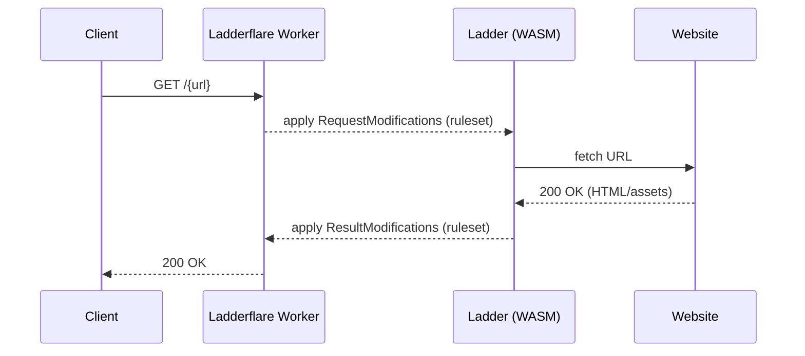
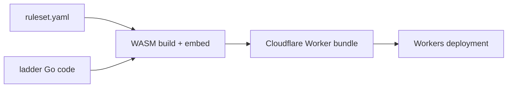

<p align="center">
  
</p>

<h1 align="center">Ladderflare</h1>

[Ladder][ladder] is a HTTP web proxy designed to bypass web restrictions through sophisticated header spoofing, content modification, and [rule-based processing][ladder-rules].

[Ladderflare][ladderflare] is a complete implementation of Ladder as a serverless application:

1. **WebAssembly**: \
compiles Go proxy logic from [`ladder`][ladder] into WebAssembly (WASM) for browser/edge execution
2. **rule processing**: \
embeds domain-specific bypass rules from [`ladder-rules`][ladder-rules] at build-time
3. **JavaScript bridge**: `index.js` provides fetch() integration and manages  communication between WASM and Cloudflare Workers platform
4. **updated interface**: \
`index.html` and `styles.css` serve an updated web interface
5. **edge deployment**:\
the complete package is deployed to Cloudflare Workers with support for the user-friendly [Deploy to Cloudflare](https://deploy.workers.cloudflare.com/?url=https://github.com/andesco/ladderflare) option

The result is a **fast bypass proxy** that successfully circumvents many web restrictions through sophisticated rule-based processing.

## Deploy to Cloudflare

### Cloudflare Dashboard

[](https://deploy.workers.cloudflare.com/?url=https://github.com/andesco/ladderflare)

<nobr>Workers & Pages</nobr> ⇢ Create an application ⇢ [Clone a repository](https://dash.cloudflare.com/?to=/:account/workers-and-pages/create/deploy-to-workers): \
   `http://github.com/andesco/ladderflare`

### Wrangler CLI
   
```bash
git clone https://github.com/andesco/ladderflare.git
cd ladderflare
npm run build
wrangler deploy
```

> [!IMPORTANT]
> To secure your worker from public acces use either Cloudflare Access or set `USERPASS`.
   
## Usage

Visit your worker and enter a URL:
`https://ladder.{subdomain}.workers.dev`

Directly append a URL to the end of Ladderflare’s hostname:
`https://ladder.{subdomain}.workers.dev/https://example.com`

Create a [bookmarklet](https://wikipedia.org/wiki/Bookmarklet) with the following URL:
`javascript:window.location.href="https://ladder.{subdomain}.workers.dev/"+location.href`

Add a shortcut to the share sheet on macOS and iOS:
[`andesco/ladder-shortcut`][ladder-shortcut]

### Limitations

* Some sites do not expose content to search engines, which means the proxy cannot access the content.
* Certain sites may display missing images or encounter formatting issues due to JavaScript- or CSS-driven rendering.


### Configuration

The worker is configured using environment variables. Set these in `wrangler.toml` file or in the Cloudflare Dashboard:

- **`USERPASS`** `{username}:{password}`
- **`DISABLE_FORM`** `false`
- **`USER_AGENT`** `Mozilla/5.0 (compatible; Googlebot/2.1; +http://www.google.com/bot.html)`
- **`X_FORWARDED_FOR`** `66.249.66.1`
- **`EXPOSE_RULESET`** `true`
- **`ALLOWED_DOMAINS`** `{domain},{domain}`
- **`ALLOWED_DOMAINS_RULESET`** `false`

Ladderflare does not support these legacy variables:

- `FORM_PATH`
- `LOG_URLS`
- `PORT`
- `RULESET`

> [!tip]
> Ladderflare does not log fetched URLs. Consider enabling Cloudflare Analytics to log usage.

### Ruleset Examples

See example rules and the canonical ruleset in [`everywall/ladder-rules`][ladder-rules] and [`ruleset.yaml`][ruleset-examples].

## Development

### How It Works



### Build Commands

```bash
npm run build:rules   # download latest ruleset from ladder-rules repository
npm run build:wasm    # compile WebAssembly binary
npm run build
npm run dev:local     # run locally using wrangler.local.toml
npm run deploy:local  # deploy using wrangler.local.toml
npm run deploy
```

### WebAssembly Implementation

- **rule parsing**: `gopkg.in/yaml.v3` loads the embedded ruleset
- **HTML manipulation**: `goquery` applies DOM-level modifications in WASM
- **JavaScript interoperability**: `syscall/js` bridges WASM to the Worker, while fetch runs in `index.js`
- **edge deployment**: tuned for Cloudflare Workers execution

### WebAssembly Build Process

1. `ruleset.yaml` downloaded from [`everywall/ladder-rules`][ladder-rules]
2. `GOOS=js GOARCH=wasm go build -ldflags="-s -w" -tags=wasm`
3. `go:embed` embedds rules directly into WASM binary



### Endpoints

- **TEST**: `ladder.{subdomain}.workers.dev/test`

- **API**: `curl -X GET "ladder.{subdomain}.workers.dev/api/{URL}"`

- **RAW:** `ladder.{subdomain}.workers.dev/raw/{URL}`

- **RULESET**: `ladder.{subdomain}.workers.dev/ruleset`

---

Ladderflare is licensed under the [MIT License](LICENSE).

[ladder]: https://github.com/everywall/ladder
[ladder-rules]: https://github.com/everywall/ladder-rules
[ruleset-examples]: https://github.com/everywall/ladder-rules/blob/main/ruleset.yaml
[ladder-shortcut]: https://github.com/andesco/ladder-shortcut
[ladderflare]: https://github.com/andesco/ladder-cloudflare
